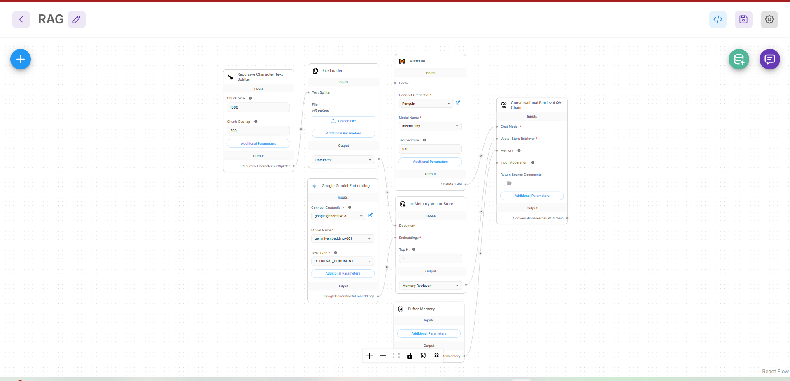
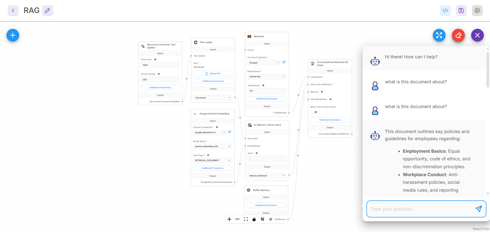

# 📄 RAG PDF QA System

A **Retrieval-Augmented Generation (RAG)** based application that allows users to ask questions from PDF documents and get accurate, context-aware answers using AI.

---

## 🚀 Project Overview

This project implements a **RAG pipeline** using:

- 🔹 LLM: Mistral AI  
- 🔹 Embeddings: Google Gemini Embeddings  
- 🔹 Vector Store: In-Memory Vector Database  
- 🔹 Framework: Flowise  

It enables users to upload PDF files and interact with them through a conversational interface.

---

## 🧠 How It Works

1. 📂 PDF is uploaded  
2. ✂️ Text is split into chunks  
3. 🔢 Embeddings are created  
4. 📦 Stored in vector database  
5. 🔍 Relevant chunks retrieved  
6. 🤖 LLM generates accurate answer  

---

## 🏗️ Architecture

### 🔹 RAG Pipeline

### 🔹 Chat UI Flow

---

## 🛠️ Tech Stack

- **Flowise**
- **Mistral AI (LLM)**
- **Google Gemini Embeddings**
- **Vector Database (In-Memory)**
- **Python (if backend used)**

---

## 📁 Project Structure
